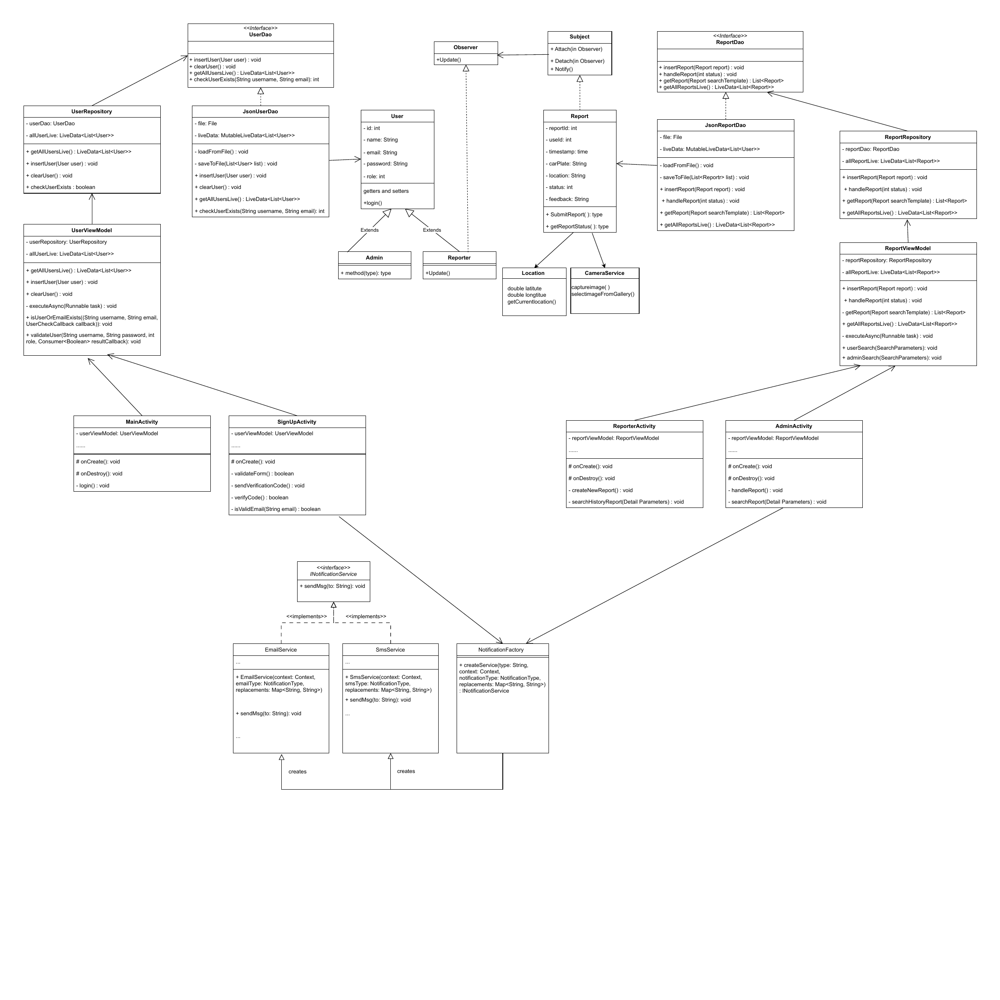

# [G05 - Team 55FiftyFive] Report

The following is a report template to help your team successfully provide all the details necessary for your report in a structured and organised manner. Please give a straightforward and concise report that best demonstrates your project. Note that a good report will give a better impression of your project to the reviewers.

Note that you should have removed ALL TEMPLATE/INSTRUCTION textes in your submission (like the current sentence), otherwise it hampers the professionality in your documentation.

*Here are some tips to write a good report:*

* `Bullet points` are allowed and strongly encouraged for this report. Try to summarise and list the highlights of your project (rather than give long paragraphs).*

* *Try to create `diagrams` for parts that could greatly benefit from it.*

* *Try to make your report `well structured`, which is easier for the reviewers to capture the necessary information.*

*We give instructions enclosed in square brackets [...] and examples for each sections to demonstrate what are expected for your project report. Note that they only provide part of the skeleton and your description should be more content-rich. Quick references about markdown by [CommonMark](https://commonmark.org/help/)*

## Table of Contents

1. [Team Members and Roles](#team-members-and-roles)
2. [Summary of Individual Contributions](#summary-of-individual-contributions)
3. [Application Description](#application-description)
4. [Application UML](#application-uml)
5. [Application Design and Decisions](#application-design-and-decisions)
6. [Summary of Known Errors and Bugs](#summary-of-known-errors-and-bugs)
7. [Testing Summary](#testing-summary)
8. [Implemented Features](#implemented-features)
9. [Team Meetings](#team-meetings)
10. [Conflict Resolution Protocol](#conflict-resolution-protocol)

## Administrative

*Instruction: please place the CORRECT link to your firebase repository here (with comp21006442@gmail.com added as an Editor)*

- Firebase Repository Link:I do not use Firebase
   - Confirm: [ ] I have already added comp21006442@gmail.com as a Editor to the Firebase project prior to due date.
- Two user accounts for markers' access are usable on the app's APK (do not change the username and password unless there are exceptional circumstances. Note that they are not real e-mail addresses in use):
   - Username: comp2100@anu.edu.au	Password: comp2100 [x] // TODO: check if done
   - Username: comp6442@anu.edu.au	Password: comp6442 [x] // TODO: check if done

## Team Members and Roles
The key area(s) of responsibilities for each member

| UID               |     Name      |                                                                                              Role |
|:------------------|:-------------:|--------------------------------------------------------------------------------------------------:|
| [u7807744]        | [Larry Wang]  | [Map module lead (GPS integration, no-parking zone detection, zone highlighting, UI alert logic)] |
| [u7807670]        |  [Eden Tian]  |                                           [[UI/UX designer (user profile display, layout flow)] ] |
| [u7864325]  | [Weimiao Sun] |                                  [Backend and storage logic lead (JSON structure, log mechanism)] |
| [u7937030]    | [Yudong Qiu]  |                             [Frontend developer (user/admin interface, frontend data integration] |
| [u8016457]     | [Nanxuan Xie] |                       [Technical lead (merge resolution, search function, data structure design)] |


## Summary of Individual Contributions

Specific details of individual contribution of each member to the project.

Each team member is responsible for writing **their own subsection**.

A generic summary will not be acceptable and may result in a significant lose of marks.

*[Summarise the contributions made by each member to the project, e.g. code implementation, code design, UI design, report writing, etc.]*

*[Code Implementation. Which features did you implement? Which classes or methods was each member involved in? Provide an approximate proportion in pecentage of the contribution of each member to the whole code implementation, e.g. 30%.]*

*you should ALSO provide links to the specified classes and/or functions*
Note that the core criteria of contribution is based on `code contribution` (the technical developing of the App).

*Here is an example: (Note that you should remove the entire section (e.g. "others") if it is not applicable)*

1. **UID1, Name1**  I have 30% contribution, as follows: <br>
  - **Code Contribution in the final App**
    - Feature A1, A2, A3 - class Dummy: [Dummy.java](https://gitlab.cecs.anu.edu.au/comp2100/group-project/ga-23s2/-/blob/main/items/media/_examples/Dummy.java)
    - XYZ Design Pattern -  class AnotherClass: [functionOne()](https://gitlab.cecs.anu.edu.au/comp2100/group-project/ga-23s2/-/blob/main/items/media/_examples/Dummy.java#L22-43), [function2()](the-URL)
    - ... (any other contribution in the code, including UI and data files) ... [Student class](../src/path/to/class/Student.java), ..., etc.*, [LanguageTranslator class](../src/path/to/class/LanguageTranslator.java): function1(), function2(), ... <br><br>

  - **Code and App Design** 
    - [What design patterns, data structures, did the involved member propose?]*
    - [UI Design. Specify what design did the involved member propose? What tools were used for the design?]* <br><br>

  - **Others**: (only if significant and significantly different from an "average contribution") 
    - [Report Writing?] [Slides preparation?]*
    - [You are welcome to provide anything that you consider as a contribution to the project or team.] e.g., APK, setups, firebase* <br><br>

1. **u7807670,EdenTian**  I have 20% contribution, as follows: <br>
- **Code Contribution in the final App**
    - Basic Feature [UIUX] – TODO:Link to be added
    - Custom Feature [Data-Profile]- TODO:Link to be added

- **Code and App Design**
    - Designed all UI components with Canva: [Canva Design Link](https://www.canva.com/design/DAGkT1Vehbg/Flnu_jIR4qnpe40JJucXzg/edit?utm_content=DAGkT1Vehbg&utm_campaign=designshare&utm_medium=link2&utm_source=sharebutton)
    - Designed App Logo and colour scheme

- **Others**
    - Report Writing and Checkpoint admin files preparation- TODO:Link to be added
    - Slides Preparation- TODO:Link to be added
    - Meeting notes drafting.- TODO:Link to be added
  
2. **u7807744,LarryWang**  I have 20% contribution, as follows: <br>
- **Code Contribution in the final App**
    - Basic Feature [Search] – TODO:Link to be added
    - Basic Feature [DataStream] - TODO:Link to be added
    - Custom Feature [Data-GPS]- TODO:Link to be added

- **Code and App Design**
    - Proposed Google API GPS integration strategy and zone validation logic – TODO:Link to be added
    - Designed visual structure of map overlays and feedback interactions – TODO:Link to be added

3. **u7864325,Weimiao Sun**  I have 20% contribution, as follows: <br>
- **Code Contribution in the final App**
    - Basic Feature [DataFiles] – TODO:Link to be added
    - Basic Feature [LoadShowData] - TODO:Link to be added
    - Custom Feature [Doc-History-Log]- TODO:Link to be added

- **Code and App Design**
    - Designed [DAO] for all user and admin data - TODO:Link to be added
    - Proposed performance upgrade: switch from `ArrayList` to AVL Tree + `HashMap`

- **Others**
    - Added test cases and refined UML model structure– TODO:Link to be added

4. **u8016457,Nanxuan Xie**  I have 20% contribution, as follows: <br>
- **Code Contribution in the final App**
    - Basic Feature [LogIn] – TODO:Link to be added
    - Basic Feature [Process-Permission] - TODO:Link to be added
  
- **Code and App Design**
    - Designed AVL Tree-based search structure and tokenizer grammar
    - Applied [Factory Method] for notifications function - TODO:Link to be added
    - Applied [Singleton] for login function - TODO:Link to be added

- **Others**
    - Coordinated all member's merge requests and resolved backend conflicts

5. **u7937030,Yudong Qiu**  I have 20% contribution, as follows: <br>
- **Code Contribution in the final App**
    - Basic Feature [UIFeedback] – TODO:Link to be added
    - Basic Feature [UI-Layout] - TODO:Link to be added

- **Code and App Design**
    - Designed fragment layout switching and adaptive UI logic
    - Applied responsive design rules for various screen sizes

- **Others**
    - Frontend and Backend integration- TODO:Link to be added


## Application Description

ParkReport is a dual-role mobile application designed to promote civic engagement in maintaining urban traffic order by reporting illegal parking incidents. It leverages GPS, real-time data capture, and a searchable reporting system to connect users and local council administrators in managing public parking compliance.

### Problem Statement

Illegal parking significantly disrupts urban traffic flow and pedestrian safety. While councils actively issue fines, the enforcement coverage is limited by human resources. According to 9News and NSW government data:

In the 2023/24 fiscal year, Sydney councils issued 822,310 paperless parking fines — a 49% increase from the previous year — generating over AUD $226 million in revenue (an average of $25,798 per hour).

Despite this, many violations go unnoticed or unreported. ParkReport addresses this gap by empowering citizens to report incidents with photo evidence in violation zones. This initiative not only increases enforcement efficiency but also promotes community involvement in upholding public order


### Application Use Cases and/or Examples

**User Role**:

- A citizen notices a car parked illegally in a designated no-parking zone.

- The app checks their location via GPS. If valid, the user is allowed to submit a report.

- The user takes a photo or uploads an image and enters the vehicle’s plate number.

- The user can view past submissions and monitor their review status (approved/denied).

**Admin Role**:

- Admin logs in to review all incoming reports.

- Reports are searchable by username and car plate.

- Admin checks the attached photo and validates the car plate format.

- Admin can approve or deny the report based on evidence.

- Once actioned, the user receives a status update.

**Target Users**:

- Concerned residents and pedestrians who witness parking violations.

- Local government or council administrators responsible for enforcing parking regulations.

**Value Proposition**

- Encourages public participation in maintaining traffic and pedestrian safety.

- Supports councils in extending surveillance and evidence collection.

- Leverages mobile systems and real-time location data for efficient reporting.


### Application UML



<hr>

## Code Design and Decisions

This section outlines the design principles and implementation decisions that underpin the ParkReport application, including the structure of the backend, search mechanism, file I/O design, and the rationale behind key architectural components.

<hr>

### Project Architecture Overview
The system follows an MVVM-inspired layered architecture with modular decomposition. Core layers include:

- **data layer**: Manages entity definition (`entities`), file-based persistence (`dao`), and access logic (`repository`).
- **viewModel layer**: Supplies data to the UI while managing lifecycle consistency.
- **ui layer**: Contains screens, fragment structures, and adapters for both admin and user roles.
- **utils and services**: Provide shared structures (e.g., AVL tree), background services (e.g., notification delivery), and search engine components.

### Data Structures

1. *AVLTree*
    * *Objective: used to store and retrieve all reports (`reportTree`) and pending review reports (`waitingReportTree`) to support fast insertion, deletion, and sorted traversal in the report module.*
    * *Code Locations: defined in [AVLTree.java](../src/utils/structures/AVLTree.java); integrated in [JsonReportDao.java](../src/data/local/dao/JsonReportDao.java); referenced in [ReportRepository.java](../src/data/local/repository/ReportRepository.java).*
    * *Reasons:*
        * *Balanced binary search tree ensures O(log n) time for insert, delete, and lookup.*
        * *Used to keep reports in order of timestamp or ID for efficient admin review.*
        * *Enables deterministic performance for potentially large datasets without full database integration.*

2. *HashMap*
    * *Objective: used for fast reverse lookups of reports by user ID (`userIdMap`) and car plate number (`plateMap`).*
    * *Code Locations: defined in [JsonReportDao.java](../src/data/local/dao/JsonReportDao.java); integrated in search filter logic of [SearchEngine.java](../src/search/SearchEngine.java).*
    * *Reasons:*
        * *Provides O(1) access to report ID lists by key.*
        * *Essential for efficient search/filter implementation via user input.*
        * *Allows instant result aggregation by user or plate, which improves admin usability.*

3. *LiveData*
    * *Objective: enables real-time reactive updates of UI when backend data changes, particularly for report and log updates.*
    * *Code Locations: defined in ViewModel classes like [ReportLogViewModel.java](../src/data/local/viewModel/ReportLogViewModel.java); connected to UI through `LiveData<List<...>>` observers in fragment/activity classes.*
    * *Reasons:*
        * *Automatically updates UI when data changes, reducing manual refreshes.*
        * *Lifecycle-aware and suitable for Android MVVM pattern.*
        * *Improves maintainability by separating data and presentation layers.*

4. *Thread Pool Executor & Handler*
    * *Objective: supports background execution of data tasks such as insert/delete in JSON files without blocking UI.*
    * *Code Locations: `Executor` and `Handler` defined in [ReportLogViewModel.java](../src/data/local/viewModel/ReportLogViewModel.java) and other ViewModel classes.*
    * *Reasons:*
        * *Ensures thread safety when mutating JSON data.*
        * *Avoids `NetworkOnMainThreadException` and ensures smooth UI transitions.*
        * *Provides flexible, reusable async execution logic via a unified `executeAsync()` method.*

5. *Append-only Log Structure*
    * *Objective: implements immutable audit logs for user and admin operations for traceability and history tracking.*
    * *Code Locations: implemented in [LogManager.java](../src/data/local/dao/JsonUserLogDao.java) and related classes in the `log` module; accessed through [UserLogRepository.java](../src/data/local/repository/UserLogRepository.java).*
    * *Reasons:*
        * *Only insertion is allowed – no deletion – which provides a clear, verifiable action trail.*
        * *Supports changelog generation for each user/report.*
        * *Helpful for meeting `Doc-History-Log` feature requirements and demonstrating data integrity.*


<hr>

### Design Patterns
1. *Factory Method Pattern*
    * *Objective: used for instantiating `Notification` objects (e.g., Email, SMS) based on notification type without hard-coding their concrete classes.*
    * *Code Locations: defined in [NotificationFactory.java](../src/service/api/NotificationFactory.java); used in [AdminActivity.java](../src/ui/admin/AdminActivity.java) and service logic like [EmailService.java](../src/service/api/EmailService.java).*
    * *Reasons:*
        * *Provides flexible and decoupled creation of notification handlers (e.g., `EMAIL`, `SMS`).*
        * *Supports future extension with new notification types without modifying existing logic.*
        * *Follows the Open/Closed Principle in SOLID.*

2. *Singleton Pattern*
    * *Objective: ensures a single instance of repository classes (e.g., `UserRepository`, `ReportRepository`) and DAOs for consistent access to in-memory and file-based storage.*
    * *Code Locations: `getInstance()` methods in [UserRepository.java](../src/data/local/repository/UserRepository.java), [ReportLogRepository.java](../src/data/local/repository/ReportLogRepository.java), [JsonUserDao.java](../src/data/local/dao/JsonUserDao.java).*
    * *Reasons:*
        * *Avoids repeated object creation and ensures shared state across ViewModels and fragments.*
        * *Improves resource management and testing stability.*
        * *Enables safe access to shared file I/O (e.g., JSON) across multiple threads.*

3. *Model-View-ViewModel (MVVM) Pattern*
    * *Objective: separates concerns between UI, data logic, and presentation state using LiveData and ViewModel.*
    * *Code Locations: ViewModels such as [UserViewModel.java](../src/data/local/viewModel/UserViewModel.java), [ReportLogViewModel.java](../src/data/local/viewModel/ReportLogViewModel.java); DAOs like [UserDao.java](../src/data/local/dao/UserDao.java); UI fragments like [HomeFragment.java](../src/ui/user/fragment/HomeFragment.java).*
    * *Reasons:*
        * *Improves maintainability and testability of UI components.*
        * *Allows reactive UI updates through `LiveData` binding.*
        * *Adheres to Android Jetpack architectural best practices.*

4. *Data Access Object (DAO) Pattern*
    * *Objective: abstracts and encapsulates access to persistent storage (JSON file).*
    * *Code Locations: interfaces and implementations in [JsonUserDao.java](../src/data/local/dao/JsonUserDao.java), [JsonReportDao.java](../src/data/local/dao/JsonReportDao.java), and [UserDao.java](../src/data/local/dao/UserDao.java).*
    * *Reasons:*
        * *Encapsulates all file I/O operations, ensuring clear separation of concerns.*
        * *Facilitates mockable and testable data layers.*
        * *Allows flexible swapping of JSON/Firebase without UI change.*

<hr>

### Parser

### <u>Grammar(s)</u>

**Purpose:**  
The grammar is designed to allow users (especially admin users) to search reports based on license plate numbers and usernames. It also supports negation using the `!` prefix, enabling flexible inclusion/exclusion of users or plates. The grammar allows either a single query or a binary expression with a `+` operator indicating logical OR between two tokens.

**Production Rules:**
```
<query> ::= <term> | <term> + <term>
<term> ::= <token>
<token> ::= !<value> | <value>
<value> ::= <plate> | <name>
<plate> ::= any string containing at least one digit
<name> ::= alphabetic string only (A–Z, a–z)
```

**Advantages:**
- Compact and human-readable grammar that covers both username and license plate filtering.
- Allows future expansion (e.g., adding `AND`, parentheses, fuzzy matching).
- Enables basic natural language-style search expressions without building a full parser generator (e.g., ANTLR).

### <u>Tokenizers and Parsers</u>

**Tokenizer Design:**

- **Where used:**  
  Tokenizer is used to process the raw input from admin users in the report search screen (e.g., searching reports by "JohnDoe + ABC123" or "!JaneSmith").

- **How built:**  
  The `Tokenizer` class first splits the input at the `+` symbol into two parts (`leftTokens` and `rightTokens`), and then parses each part using `parsePart()` which:
    - Detects optional negation with `!`
    - Classifies the token as either `"name"`, `"plate"` or `"invalid"` via regex
    - Returns a `Token` object with `type` and `value`

- **Core logic implemented in:**  
  [`Tokenizer.java`](../src/search/Tokenizer.java) – methods:
    - `tokenize(String input)`
    - `parsePart(String value)`
    - `classify(String input)`

**Parser Design:**

- **Where used:**  
  The `Parser` receives the `TokenPair` object from the tokenizer and wraps it into a structured `QueryResult` object that splits left-hand and right-hand token lists.

- **How built:**  
  The `Parser` does not re-interpret the token but prepares it for the `SearchEngine` to process. It separates the parsing stage from evaluation logic, improving modularity.

- **Implemented in:**  
  [`Parser.java`](../src/search/Parser.java)

**Advantages of Design:**
- Clear separation between **lexical analysis (tokenizer)**, **syntactic structuring (parser)**, and **semantic evaluation (search engine)**.
- Easily testable components and modularity make the system maintainable and extensible.
- Avoids coupling query parsing logic with business logic (e.g., database or view updates).
- Grammar rules are simple enough to be implemented manually (without external parser libraries).


<hr>

### Others

//TODO TBD

<br>
<hr>

## Implemented Features
//TODO add screenshot to demonstrate

### Basic Features

1. [LogIn]. Supports admin login functionality using existing credentials (comp2100@anu.edu.au / comp2100). (easy)
    * Code: [LoginRepository.java](../app/src/main/java/com/example/parkingreport/data/local/repository/LoginRepository.java), [LoginActivity.java](../app/src/main/java/com/example/parkingreport/ui/login/LoginActivity.java)
    * Description of feature: Allows admins to log in securely and access the administrative interface.
    * Description of your implementation: Used Singleton pattern for login session management; login data validated from JSON-stored user credentials.

2. [DataFiles]. Maintains dataset of user profiles, reports, logs, and metadata. (easy)
    * Code to the Data File: [user.json](../app/src/main/assets/user.json), [report.json](../app/src/main/assets/report.json), [log.json](../app/src/main/assets/log.json)
    * Description of feature: JSON-formatted dataset simulates persistent storage and provides at least 2,500+ entries.
    * Description of your implementation: Used GSON for serialization/deserialization; structured files into append-only formats with log tracking.

3. [LoadShowData]. Loads and displays dataset records. (easy)
    * Code: [UserStorage.java](../app/src/main/java/com/example/parkingreport/data/local/storage/UserStorage.java), [ReportAdapter.java](../app/src/main/java/com/example/parkingreport/ui/adapter/ReportAdapter.java)
    * Description of feature: Dynamically loads user and report data to UI.
    * Description of your implementation: LiveData + ViewModel used for observing local data changes; adapter renders report entries to RecyclerView.

4. [DataStream]. Simulates live data updates from background service. (medium)
    * Code: [ReportLogViewModel.java](../app/src/main/java/com/example/parkingreport/data/local/viewModel/ReportLogViewModel.java), [ReportLogRepository.java](../app/src/main/java/com/example/parkingreport/data/local/repository/ReportLogRepository.java)
    * Description of feature: Emulates background data push (e.g., admin approval) reflected in UI.
    * Description of your implementation: Custom executor with Android Handler used to simulate async updates; auto-refresh of report status triggered.

5. [Search]. Allows admin to search by license plate or username using structured grammar. (medium)
    * Code: [SearchEngine.java](../app/src/main/java/com/example/parkingreport/search/SearchEngine.java), [Tokenizer.java](../app/src/main/java/com/example/parkingreport/search/Tokenizer.java), [Parser.java](../app/src/main/java/com/example/parkingreport/search/Parser.java)
    * Description of feature: Enables token-based search with negation and dual-query support (e.g. "JohnDoe + !XYZ789").
    * Description of your implementation: Designed formal grammar; implemented tokeniser/parser to handle input logic and mapped results to UI via adapter.

6. [UXUI]. Ensures cohesive layout and theme consistency. (easy)
    * Code: [AdminFragment.java](../app/src/main/java/com/example/parkingreport/ui/admin/AdminFragment.java), [activity_main.xml](../app/src/main/res/layout/activity_main.xml)
    * Description of feature: Maintains visual consistency across screens, everything designed on Canva in advance
    * Description of your implementation: Canva-based layout design; consistent padding, font, and colour styles applied throughout app.

7. [UIFeedback]. Provides responsive feedback on actions (e.g., errors, empty results). (easy)
    * Code: [ReportAdapter.java](../app/src/main/java/com/example/parkingreport/ui/adapter/ReportAdapter.java), [ToastHelper.java](../app/src/main/java/com/example/parkingreport/util/ToastHelper.java)
    * Description of feature: Guides users/admins with toasts or visual cues.
    * Description of your implementation: Toasts and button state feedback added across fragments and views.

---

### Custom Features

**Feature Category: Location Awareness**

1. [Data-GPS]. Detects user location and limits report submission to violation areas. (easy)
    * Code: [MapFragment.java](../app/src/main/java/com/example/parkingreport/ui/map/MapFragment.java)
    * Description of your implementation: Uses Google Maps API and location manager; overlays no-parking polygons and validates location before enabling camera button.

2. [Data-Profile]. Allows users to view/update avatar image in their profile. (easy)
    * Code: [UserProfileFragment.java](../app/src/main/java/com/example/parkingreport/ui/user/UserProfileFragment.java)
    * Description of your implementation: ImagePicker handles avatar update; profile info stored locally and visual changes reflected instantly.

---

**Feature Category: UI Design and Testing**

3. [UI-Layout]. Supports both portrait and landscape screen orientations. (easy)
    * Code: [MainActivity.java](../app/src/main/java/com/example/parkingreport/MainActivity.java), [layout-sw600dp](../app/src/main/res/layout-sw600dp)
    * Description of your implementation: Used alternative layouts and resource qualifiers; handled fragment resizing and adapter recomposition on orientation changes.

---

**Feature Category: Document Version Control**

4. [Doc-History-Log]. Maintains append-only log of user/report changes. (medium)
    * Code: [LogManager.java](../app/src/main/java/com/example/parkingreport/data/local/storage/LogManager.java), [ReportLog.java](../app/src/main/java/com/example/parkingreport/data/local/entities/ReportLog.java)
    * Description of your implementation: All operations (insert, modify, delete) are logged with timestamps; logs displayed on admin interface via LiveData.

---

**Feature Category: Creating Processes**

5. [Process-Permission]. Enforces role-based visibility between user and admin. (easy)
    * Code: [LoginRepository.java](../app/src/main/java/com/example/parkingreport/data/local/repository/LoginRepository.java), [RoleManager.java](../app/src/main/java/com/example/parkingreport/util/RoleManager.java)
    * Description of your implementation: User role determined on login; fragment visibility and access routes tailored to role.


<hr>

### Surprise Feature

//TODO
*Instructions:*
- If implemented, explain how your solution addresses the task (any detail requirements will be released with the surprise feature specifications).
- State that "Surprise feature is not implemented" otherwise.

<br> <hr>


## Testing Summary

//TODO
*[What features have you tested? What is your testing coverage?]*
*Please provide details (see rubrics) including some screenshots of your testing summary, showing the achieved testing coverage. Feel free to provide further details on your tests.*

*Here is an example:*

1. Tests for Search
   - Code: [TokenizerTest Class, entire file](https://gitlab.cecs.anu.edu.au/comp2100/group-project/ga-23s2/-/blob/main/items/media/_examples/Dummy.java) for the [Tokenizer Class, entire file](https://gitlab.cecs.anu.edu.au/comp2100/group-project/ga-23s2/-/blob/main/items/media/_examples/Dummy.java#L22-43)
   - *Number of test cases: ...*
   - *Code coverage: ...*
   - *Types of tests created and descriptions: ...*

2. xxx

...

<br> <hr>


## Summary of Known Errors and Bugs

//TODO
*[Where are the known errors and bugs? What consequences might they lead to?]*
*List all the known errors and bugs here. If we find bugs/errors that your team does not know of, it shows that your testing is not thorough.*

*Here is an example:*

1. *Bug 1:*
    - *A space bar (' ') in the sign in email will crash the application.*
    - ...

2. *Bug 2:*
3. ...

<br> <hr>


## Team Management

### Meeting Minutes
* Link to the minutes of your meetings like above. There must be at least 4 team meetings.
  (each committed within 2 days after the meeting)
* Your meetings should also have a reasonable date spanning across Week 6 to 11.*


- [Team Meeting 1 – 14 April 2025 (Week 6)](../items/media/2025-04-14-meeting.md)
- [Team Meeting 2 – 17 April 2025 (Week 7)](../items/media/2025-04-17-meeting.md)
- [Team Meeting 3 – 20 April 2025 (Week 8)](../items/media/2025-04-20-meeting.md)
- [Team Meeting 4 – 22 April 2025 (Week 8)](../items/media/2025-04-22-meeting.md)
- [Team Meeting 5 – 30 April 2025 (Week 9)](../items/media/2025-04-30-meeting.md)
- [Team Meeting 6 – 04 May 2025 (Week 10)](../items/media/2025-05-04-meeting.md)

Each meeting focused on milestone planning, integration tasks, bug triage, and refining UI logic. Minutes include agenda, outcomes, action points, and deadlines for each team member.

<hr>

### Conflict Resolution Protocol

//TODO will summarize after project finished
*[Write a well defined protocol your team can use to handle conflicts. That is, if your group has problems, what is the procedure for reaching consensus or solving a problem?
(If you choose to make this an external document, link to it here)]*

*If your group has issues, how will your group reach consensus or solve the problem?*
*- e.g., if a member gets sick, what is the solution? Alternatively, what is your plan to mitigate the impact of unforeseen incidents for this 6-to-8-week project?*

This shall include an agreed procedure for situations including (but not limited to):
- A member is sick in the final week of the project.
- A member didn't complete the assigned task which should've been completed before the checkpoint, and the checkpoint is approaching.
- A member is unreachable (didn't respond messages in your agreed communication channels and emails in two days).
- The team have different understandings toward the requirement of the assignment.


